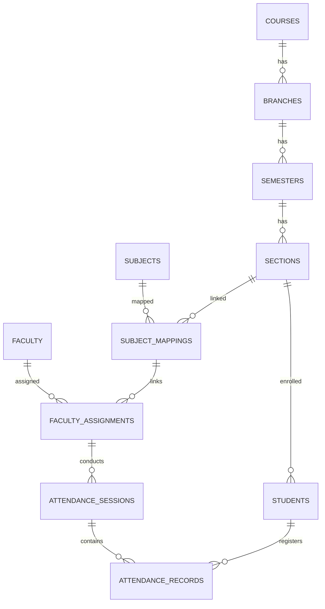

# Implementation Plan: Attendance Management System (AMS)

This document outlines the step-by-step plan to implement the Attendance Management System (AMS) using **Flutter** and **Riverpod** for state management, with a **Local Data / In-Memory Service Layer** initially, to be swapped with Firebase in the final phase.

---

## 🛠 Phase 1: Environment Setup & Configuration

### 1.1 Add Dependencies [Completed]
Configure [pubspec.yaml](file:///home/alucard/Projects/classvault/pubspec.yaml) to include Riverpod and other utility packages.

```yaml
dependencies:
  flutter:
    sdk: flutter
  flutter_riverpod: ^2.5.1
  go_router: ^14.2.0
  csv: ^6.0.0
  excel: ^4.0.0
  file_picker: ^8.0.0
  fl_chart: ^0.68.0
  intl: ^0.19.0
  cupertino_icons: ^1.0.8
```

### 1.2 Setup Project Directory Structure [Completed]
We will adopt a Feature-First clean directory structure:
```text
lib/
├── main.dart
├── app.dart
├── core/
│   ├── constants/       # App constants, colors, assets
│   ├── theme/           # App-wide visual themes (light/dark mode)
│   ├── router/          # GoRouter definitions
│   └── widgets/         # Shared UI components
├── data/
│   ├── models/          # Data serialization models
│   ├── repositories/    # Abstract repositories interfaces
│   └── services/        # Local in-memory repository implementations
└── features/
    ├── auth/            # Login and Role Selection
    ├── admin/           # Modules 1-9 (Courses, Branches, Students, Faculty etc.)
    ├── faculty/         # Sessions, Attendance Marking/Editing
    ├── student/         # Personal Dashboard & Subject-wise attendance
    └── reports/         # Attendance Analytics & Defaulters
```

---

## 📅 Phase 2: Database Schema & Local Authentication

### 2.1 Local Auth Service [Completed]
Set up a mock Auth Service. Users can log in with preset accounts representing different roles:
- Admin: `admin@classvault.com` (password: `admin123`)
- Faculty: `faculty@classvault.com` (password: `faculty123`)
- Student: `student@classvault.com` (password: `student123`)

### 2.2 Local Repository Schema [Completed]
Designing abstract repository interfaces and their in-memory/local-storage implementations to reflect: `Course ➔ Branch ➔ Semester ➔ Section ➔ Students`.
This ensures we can swap to Firebase later by simply changing the repository implementation in the Riverpod providers.




#### Collections Structure:
1. **/users** (Document ID = Firebase Auth UID)
   * `uid`: String
   * `name`: String
   * `email`: String
   * `role`: String ('admin' | 'faculty' | 'student')
   * `associatedId`: String (Link to `studentId` or `facultyId`)
2. **/courses**
   * `id`: String (auto-gen)
   * `name`: String (e.g., 'B.Tech')
3. **/branches**
   * `id`: String
   * `courseId`: String
   * `name`: String (e.g., 'CSE')
4. **/semesters**
   * `id`: String
   * `branchId`: String
   * `semesterNumber`: Int (e.g., 6)
5. **/sections**
   * `id`: String
   * `semesterId`: String
   * `name`: String (e.g., 'A')
6. **/students**
   * `id`: String
   * `rollNumber`: String
   * `name`: String
   * `sectionId`: String
   * `semesterId`: String
7. **/faculty**
   * `id`: String
   * `employeeId`: String
   * `name`: String
   * `email`: String
8. **/subjects**
   * `id`: String
   * `code`: String
   * `name`: String
9. **/subject_mappings**
   * `id`: String
   * `sectionId`: String
   * `subjectId`: String
10. **/faculty_assignments**
    * `id`: String
    * `facultyId`: String
    * `subjectMappingId`: String
11. **/sessions**
    * `id`: String
    * `facultyId`: String
    * `subjectId`: String
    * `sectionId`: String
    * `date`: Timestamp
    * `startTime`: Timestamp
    * `endTime`: Timestamp
12. **/attendance**
    * `id`: String
    * `sessionId`: String
    * `studentId`: String
    * `status`: String ('present' | 'absent')

---

## 🖥️ Phase 3: Core Implementation Steps

### Step 1: Authentication & Root Routing
- [x] Setup `GoRouter` with redirect logic checking Local Auth state.
- [x] Implement Sign In screen for all roles.
- [x] Query user roles on successful login to redirect to correct dashboard:
  - Admin Dashboard -> `/admin`
  - Faculty Dashboard -> `/faculty`
  - Student Dashboard -> `/student`

### Step 2: Administrative Modules (Admin CRUDs)
Build interactive tables and dialogs for the administrator to manage setup:
- [x] **Courses, Branches, Semesters & Sections**: Hierarchy selection screen.
- [x] **Subjects**: Management list (Subject Code & Subject Name).
- [x] **Class Subject Mapping**: Map subjects to Section IDs.
- [x] **Faculty Management & Assignments**:
  - CRUD for Faculty records.
  - Form to link Faculty to Subject Mappings.

### Step 3: Student Management & CSV Import (Admin Module)
- [x] **Student CRUD**: Screen to manage individual student data.
- [x] **Bulk Import Screen**: 
  - Read files using `file_picker`.
  - Process CSV/XLSX rows.
  - Implement duplicate check (against Roll Number in the selected section).
  - Preview dialog/table showing raw rows before committing bulk writes to Local Storage.

### Step 4: Faculty Operations (Attendance Workflow)
- [x] **My Classes Screen**: Fetch all Class Subject Mappings assigned to the logged-in Faculty.
- [x] **Create Session Screen**: Set date, start time, and end time.
- [x] **Mark Attendance Screen**:
  - Fetch all students mapped to the selected Section.
  - Set default state: **All Students Present**.
  - Simple checkbox/toggle list for marking absentees (clicking toggles state between ✓ and ✗).
  - Save button writing to Local Storage (`sessions` list + `attendance` records).
- [x] **Edit Attendance Screen**: Load previous sessions to update record states.

### Step 5: Student Portal
- [x] **Student Dashboard**: 
  - Show overall attendance percentage.
  - Show subject-wise breakdown (List of subjects, classes attended vs. conducted).
  - List recent attendance activity.

### Step 6: Reports & Analytics Module (Shared access based on Role)
- [x] **Student Report**: Detailed history view for single student.
- [x] **Subject Report**: Statistics on conducted classes, attendee rates, and **Defaulter List** (defaulter filter: `<80%`, `<60%`, `<40%`).
- [x] **Faculty Report**: Details on number of sessions conducted per assigned class.
- [x] **Export Feature**: Add PDF and Excel export helpers.

### Step 7: Semester Promotion Module (Admin Tool)
- [x] **Promotion Workflow Interface**:
  - Select source Semester and Section.
  - Select destination Semester.
  - Perform batch updates in Local Storage to transition student `semesterId`/`sectionId` while preserving past `attendance` histories.

---

## 🧪 Phase 4: Testing & Verification with Local Data

- [x] Verify attendance updates are immediate (using Riverpod local data providers).
- [x] Validate CSV parser handling wrong headers or empty records gracefully.
- [x] Test role-based UI restriction and flow correctness.
- [x] Migrate all screens to `ResponsiveScaffold` for unified navigation and branding.
- [x] Implement interactive placeholders (Command Palette search dialog, live notifications tray, and user profile menus).
- [x] Align application colors and theme with the exact light color scheme from the reference mockup (enforced ThemeMode.light and primary color 0xFF4C5DF4).
- [x] Fix login screen card alignment and border overflow issue in desktop layout.
- [x] Resolve screen overflow issues and enable application support for multiple display resolutions (e.g. 720p screens).

---

## ✨ Phase 5: UX Enhancements

### 5.1 Attendance Marking — Usability
- [x] Add "Mark All Present" / "Mark All Absent" bulk-toggle buttons above the student roster grid in `mark_attendance_screen.dart`.
- [x] Add a confirmation dialog before `_saveAttendance()` fires to prevent accidental submission.
- [x] Add a search/filter bar on the student roster (filter by name or roll number) for large sections.
- [x] Remove the duplicate student roster fetch inside `_proceedToRoster()` — `_onAssignmentChanged` already loads the roster when the dropdown changes.
- [x] Replace `TextDecoration.lineThrough` on absent students with reduced opacity + tinted background (less punitive, more readable).

### 5.2 Error & Loading States
- [x] Add `snapshot.hasError` branches to every `FutureBuilder` (admin dashboard, student dashboard, faculty dashboard, reports dashboard) — currently silently shows nothing on failure.
- [x] Add `RefreshIndicator` (pull-to-refresh) to all list/dashboard screens — data is stale until the user navigates away and back.
- [ ] Replace bare `CircularProgressIndicator` loading states with skeleton/shimmer placeholders that reflect the actual content layout.

### 5.3 Student Dashboard — Actionable Insights
- [x] Add "classes you can still miss" counter using the formula `floor((attended - 0.75 * conducted) / 0.25)` so students know their buffer at a glance.
- [x] Add subject code (`[CODE]`) to the subject-wise breakdown cards for consistency with the faculty dashboard.
- [x] Show a trend indicator (improving / declining attendance) on the overall percentage card by comparing the last 5 sessions vs the 5 before that.
- [x] Align the student warning threshold (currently 75%) with the admin defaulter threshold (80%) via a shared constant.

### 5.4 Admin Dashboard — Real Data
- [x] Replace hardcoded metric card trend strings ("↑ 8.5% this month", etc.) with real computed values comparing current vs previous month record counts, or remove them entirely.
- [x] Add y-axis labels and an 80% threshold line to the Weekly Attendance Analytics bar chart.
- [x] Add a "View All" link on the Defaulter Watchlist card when the list is truncated.

### 5.5 Navigation & Shell
- [x] Add a `BottomNavigationBar` for mobile/tablet (≤960px) as the primary nav for Faculty — the drawer requires an extra tap for every route switch.
- [x] Wire the notification badge count to the real computed defaulter list instead of the hardcoded "4".
- [x] Add a dark/light mode toggle to the user profile `PopupMenuButton` in `ResponsiveScaffold`.
- [x] Make preset login buttons in `login_screen.dart` auto-submit (fill + login in one tap) for demo convenience.

### 5.6 Code Quality
- [x] Migrate all `.withOpacity()` calls to `.withValues(alpha:)` (deprecated in Flutter 3.27+).
- [x] Extract the hardcoded `75.0` / `80.0` attendance thresholds into a shared `AppConstants` class.
- [x] Fix near-invisible card borders (`dividerColor.withOpacity(0.08)`) in dark mode — raise to `0.15` or use a fixed token color.

---

## 🌐 Phase 6: Firebase Integration (To be done last)

- [ ] Initialize Firebase Core and Auth in `main.dart`.
- [ ] Implement Firebase Firestore services implementing the repository interfaces.
- [ ] Swap Riverpod providers from Local Services to Firebase Services.
- [ ] Write Firestore security rules and test authentication.


